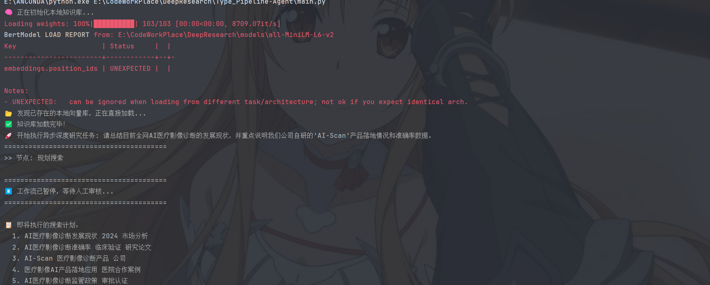
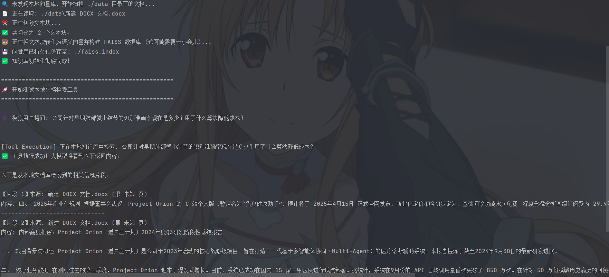

#  DeepResearch Pipeline Agent

基于 **Agentic Workflow（智能体工作流）** 的深度研究与报告生成助手。本项目结合了动态本地知识库检索（RAG）与大模型异步并发搜索能力，能够根据用户输入的研究主题，自动进行任务拆解、多线程信息收集，并最终合成结构化、可溯源的专业研究报告。

------

## ⚙️ 核心架构 (四层解耦)

本项目采用高度模块化的设计，确保系统的鲁棒性与极强的可扩展性：

- **控制层 (Workflow)**：基于 LangGraph 构建有向图，利用 Checkpointer 实现状态持久化与“人在回路 (HITL)”的断点干预机制。
- **逻辑层 (Agents)**：采用 ReAct 模式将核心任务解耦为 **Planner**（任务拆解与规划）、**Searcher**（多路并发检索）与 **Writer**（信息聚合与长文渲染）。
- **工具层 (Tools)**：无缝集成 FAISS 本地向量检索、Tavily 全网搜索与 Jina Reader 网页深度抓取引擎。
- **状态层 (Schema)**：基于 `TypedDict` 与 `Pydantic` 进行强类型约束，确保多智能体间上下文传递的绝对确定性。

------

## ✨ 核心特性

### 混合检索架构 (RAG + Web Search)

打破单一信息源的局限，打造全方位知识图谱：

- **时效性补充**：结合全网实时搜索，精准弥补本地知识库的时效性盲区。
- **网页深度去噪**：集成 Jina Reader 突破传统搜索引擎 Snippet（摘要）的信息瓶颈，直接提取网页 Markdown 正文，显著降低模型幻觉。

###  智能体工作流 (Agentic Pipeline)

- **任务规划 (Planner)**：将宏观的复杂研究课题，智能拆解为多个具体、垂直的可执行子搜索计划。
- **深度撰写 (Writer)**：汇总所有跨平台的碎片化信息，自动生成排版精良、逻辑清晰的 Markdown 深度长文报告。

### 异步高并发架构 (Asyncio Engine)

由传统的串行检索全面升级为 **Asyncio 并发检索**。当 Planner 拆分出 N 个子任务时，系统会多线程同时调度网络搜索、本地检索与网页抓取（例如同时拉取市场分析、临床验证、政策审批等数据），整体端到端耗时缩短至原有的 **20%~30%**。

### 动态全自动 RAG (Dynamic RAG)

全面升级的本地私有知识处理引擎：

- **多格式兼容**：原生支持 PDF 与 Word 等主流文档格式的自动化解析。
- **智能切分策略**：采用 `RecursiveCharacterTextSplitter`，设置 500 字块大小与 50 字重叠度，完美解决长文档检索时的语意截断痛点。
- **零延迟二次启动**：引入 `FAISS.save_local` 持久化机制。首载成功后，下次启动将直接从本地索引加载，无需重复进行昂贵的向量化计算。
- **完全隐私保护**：支持指定 `local_model_path` 加载离线向量模型（如 `sentence-transformers/all-MiniLM-L6-v2`），确保敏感文档处理流程不出内网。

### 人类干预 (Human-in-the-loop)

将控制权交还给人类，提升研究精准度与成本效益：

- 工作流在“任务规划”与“数据执行”之间原生支持人工介入。
- 用户可以在终端实时审核 Agent 生成的搜索计划，确认无误后按 `[Enter]` 继续执行，或随时进行微调与干预。

------

# 🛠️ 技术栈清单

- **大模型驱动**：DeepSeek-V3/R1, HuggingFace (`all-MiniLM-L6-v2`)
- **核心框架**：LangGraph, LangChain, Pydantic, Python Asyncio
- **检索与中间件**：FAISS, Tavily Search API, Jina Reader API

## 🛠️ 环境依赖

推荐使用 Python 3.9+ 环境。

```bash
# 克隆项目
https://github.com/1022260464/LangGraph_learnigDemo.git
cd Type_Pipeline-Agent

# 安装核心依赖 (示例，可以根据实际 requirements.txt 补充，或直接使用 pip install -r requirements.txt)
pip install -r requirements.txt
# LangGraph:
pip install langgraph msgpack
```

*注：国内网络环境下，建议在环境中配置 `HF_ENDPOINT=https://hf-mirror.com` 以加速 HuggingFace 模型的下载。*

### 	环境配置与初始化

1. **准备离线模型 (可选)**： 若需离线运行，请将 `all-MiniLM-L6-v2` 下载至 `models/` 文件夹。

2. **投放本地资料**： 将需要研究的内部参考资料（如公司年报、技术标准）放入 `data/` 文件夹。

3. **安装新增依赖**：

   ```
   pip install pypdf docx2txt langchain-huggingface faiss-cpu
   ```

## 🚀 快速开始

运行主程序入口：

```bash
python main.py
```

**交互流程示例：**
1. 系统初始化本地知识库模型。
2. 输入你的深度研究 Prompt（例如：“请总结目前全网AI医疗影像诊断的发展现状...”）。
3. Agent 自动生成 5 个维度的搜索计划。
4. **人工审核**：终端提示 `⏸️ 工作流已暂停，等待人工审核...`，按回车继续。
5. 系统启动并发搜索，拉取数据。
6. 自动在终端/本地输出完整的《研究分析报告》。

## 📂 项目结构 (示例)

```text
DeepResearch/Type_Pipeline-Agent/
├── main.py                 # 异步主程序入口，管理整个生命周期
├── data/                   # 本地原始文档存放处 (支持 .pdf, .docx)
├── faiss_index/            # 自动生成的向量数据库持久化目录
├── models/                 # 存放离线 Embeddings 模型，确保内网可用
├── workflow/
│   └── graph.py            # LangGraph 工作流（拓扑）定义，处理节点跳转与并发逻辑
├── agents/
│   ├── TaskAgent.py        # 规划者：负责任务拆解与结构化输出定义
│   ├── SearchAgent.py      # 执行者：集成 ReAct 模式，自动调度多路工具
│   └── WriterAgent.py      # 创作者：负责长文总结与 Markdown 渲染
└── tools/
    ├── rag_tool.py         # 核心升级：支持动态扫描、文本切分与本地索引加载
    └── reader_tool.py      # 深度阅读：基于 Jina Reader 的网页去噪提取
```

### 🗺️ 路线图 (Roadmap - 已完成)

- [x]  **Agent 工作流搭建**：实现 Plan -> Search -> Write 的基础图结构。

- [x] **Human-in-the-loop**：实现规划阶段的终端人工审批挂起机制。
- [x] **并发执行优化**：利用 `asyncio.gather` 实现多路任务并行化。
- [x] **动态 RAG 接入**：实现 `data/` 目录动态扫描与 FAISS 索引自动构建/加载。
- [x] **离线化支持**：支持本地 Embedding 模型加载，提升企业级安全性。

# 最终结果展示：




# 本地文档检索测试：



# 示例生成结果展示：

1. 可以看到，搜索结果包含了本地知识库的内容

```
>> 节点: 所有并发搜索已完成，获取到 5 份有效资料
>> 节点: 撰写报告

✅ 报告已生成！
========================================
📑 标题: AI医疗影像诊断发展现状与AI-Scan产品落地分析报告
💡 摘要: 本报告全面分析了2024年AI医疗影像诊断领域的发展现状，并重点阐述了公司自研AI-Scan产品的落地情况和准确率数据。

**全网AI医疗影像诊断发展现状**：2024年中国AI医学影像市场规模约74.5亿元，同比增长160.5%，预计2025年突破150亿元。全球市场预计从2023年25亿美元增长至2028年超100亿美元，年复合增长率32%。截至2024年6月，中国药监局累计批准92款AI医学影像三类医疗器械注册证。技术方面，多模态融合、大模型应用成为主要趋势，临床超过70%的诊断依赖医学影像，AI医学影像成为最成熟应用领域。

**AI-Scan产品落地情况**：公司自研的AI-Scan医疗影像诊断产品已在三甲医院实现商业化落地应用，2024年研发投入5000万元。产品专注于肺结节早期筛查，采用多模态融合技术，不仅分析CT影像，还结合患者电子病历(EMR)数据进行综合诊断。产品支持与医院现有PACS系统无缝集成，已获得三类医疗器械认证（针对乳腺等特定部位），预计2025年通过药监局审批。

**AI-Scan准确率数据**：AI-Scan产品在肺结节早期筛查中准确率提升至98%，显著高于行业平均水平。产品通过AI辅助减少人为判断误差，确保不同医院、不同医生诊断标准一致性，支持动态影像流实时病灶识别。

【一、全网AI医疗影像诊断发展现状】
**1.1 市场规模与增长趋势**
2024年中国AI医学影像市场规模约74.5亿元，同比增长160.5%，预计2025年突破150亿元，2026年达235.7亿元。全球AI医疗影像市场预计从2023年25亿美元增长至2028年超100亿美元，年复合增长率32%。截至2024年6月，中国药监局累计批准92款AI医学影像三类医疗器械注册证。

**1.2 技术进展与突破**
- **多模态融合**：AI模型整合影像、临床病史、检验数据等多源信息，生成更全面精准诊疗报告
- **大模型应用**：联影智能「元智」医疗大模型支持10余种影像模态、超300种影像处理任务，复杂病灶诊断精准度超95%
- **深度学习突破**：卷积神经网络实现自动特征学习，在特定任务上达到甚至超越人类专家水平
  - 肺结节检测：CheXNet系统检测肺炎表现超越普通放射科医生
  - 脑出血识别：AI模型数秒内识别颅内出血，比人工识别快90%，准确率超98%
  - 乳腺钼靶筛查：Google Health AI模型降低假阴性率9.4%，假阳性率5.7%
- **全工作流集成**：覆盖从影像采集到报告生成全链条，包括智能质控、自动分割量化、结构化报告、预后预测
- **放射组学**：分析影像纹理和深度学习特征，预测肿瘤治疗反应率和患者生存期

**1.3 应用领域与临床效果**
AI医疗影像诊断已覆盖心血管疾病、肺部疾病、脑血管疾病、骨科检查、眼底疾病、乳腺疾病等多个医学领域。在临床实践中，AI辅助诊断系统诊断准确率达95%，将单例影像诊断时间从15分钟缩短至3分钟，效率提升80%。在基层医院应用中，有效弥补放射科专业医生不足，推动基层医院影像诊断能力提升60%。

**1.4 市场趋势与挑战**
- **政策支持**：2024年11月卫健委发布《卫生健康行业人工智能应用场景参考指引》，明确84个细分领域应用场景
- **技术趋势**：联邦学习解决数据孤岛问题，同态加密与差分隐私保障数据安全，可解释AI提升临床信任度
- **商业化挑战**：支付体系不完善（多数产品未纳入医保），商业模式仍在探索（平台分成、软件售卖、硬件结合）
- **临床落地**：产品同质化严重（95%研究集中在医学影像类），算法可解释性不足，模型泛化能力有待提升
- **市场接受度**：医生对新技术接受需时间，患者信任度低，尤其基层'一老一小'群体倾向面对面诊疗

【二、AI-Scan产品技术架构与特点】
**2.1 核心产品定位**
AI-Scan是公司自研的AI医疗影像诊断核心产品，2024年研发投入5000万元。产品已在三甲医院实现商业化落地应用，专注于肺结节早期筛查，准确率提升至98%。

**2.2 技术架构特点**
- **多模态融合技术**：不仅分析CT影像，还结合患者电子病历(EMR)数据进行综合诊断
- **深度学习算法**：具备持续学习优化能力，支持与医院现有PACS系统无缝集成，不改变医生原有工作流程
- **实时分析能力**：支持动态影像流实时病灶识别

**2.3 产品优势**
- **筛查效率提升**：将肺结节筛查准确率从行业平均水平大幅提升
- **误诊率降低**：通过AI辅助减少人为判断误差
- **诊断标准化**：确保不同医院、不同医生诊断标准一致性
- **工作流兼容**：设计符合医生实际工作习惯的交互界面

**2.4 市场与监管进展**
- **监管认证**：已获得三类医疗器械认证（针对乳腺等特定部位），预计2025年通过药监局审批
- **标准符合**：符合DICOM国际医疗影像标准
- **部署模式**：支持本地化部署和云端SaaS服务模式

【三、AI-Scan产品落地情况与准确率数据】
**3.1 商业化落地情况**
AI-Scan产品已在三甲医院实现商业化落地应用，具体落地医院信息未在公开资料中披露。产品采用与医院合作模式，获取专家标注数据，采用半自动标注技术解决数据标注难题。

**3.2 准确率数据**
- **肺结节筛查准确率**：AI-Scan产品在肺结节早期筛查中准确率提升至98%
- **对比行业水平**：显著高于行业平均水平，深睿医疗Dr. Wise CAD系统肺结节检测准确率为98.8%，医准智能系统3mm-13mm结节检出率98.6%
- **误诊率降低**：通过AI辅助减少人为判断误差，提升诊断一致性

**3.3 临床效果验证**
产品通过大规模多中心数据训练提升模型适应性，解决算法泛化能力问题。在临床验证中，产品表现优于传统医生肉眼筛查准确率（约65%）。

**3.4 技术挑战与解决方案**
- **数据标注难题**：与医院合作获取专家标注数据，采用半自动标注技术
- **算法泛化能力**：通过大规模多中心数据训练提升模型适应性
- **临床工作流整合**：设计符合医生实际工作习惯的交互界面
- **数据安全**：采用先进加密技术和严格隐私保护协议

【四、行业对比与竞争分析】
**4.1 主要竞争对手产品准确率**
- **肺结节检测**：
  - 深睿医疗Dr. Wise CAD系统：肺结节检测准确率高达98.8%
  - 医准智能系统：3mm-13mm结节检出率98.6%，综合检出率94.2%
  - PereDoc系统：2-5mm肺结节检出率94.9%，>5mm结节检出率99.2%
  - 深睿医疗系统：肺癌检出率>98%

- **乳腺癌诊断**：
  - 基于DL的切片病理图像分析系统总体准确率83.1%
  - 转移性乳腺癌自动筛查灵敏度91.0%
  - AI方法在乳房X光片分类平均灵敏度比乳腺影像专家提升14.0%

- **脑卒中诊断**：
  - 基于DL的颅脑CT图像处理系统AUC值达84.6%
  - 缺血性脑卒中自动诊断方法灵敏度98.1%、特异度96.9%、AUC值99.3%

**4.2 监管审批对比**
截至2023年底，中国NMPA批准73款AI医疗器械产品上市，美国FDA批准692款，其中89.6%为AI辅助医学图像处理产品。获批产品数量前三公司：GE医疗（53款）、西门子（40款）、佳能（22款）。

**4.3 市场渗透率预测**
AI在中国CT、MRI及超声扫描的渗透率持续增长，预计到2030年CT渗透率可达39.5%，MRI达44.8%，超声达40.2%。

【五、发展趋势与建议】
**5.1 技术发展趋势**
- **从单一疾病检测向多模态数据融合发展**：结合PET、CT、MRI等多种成像技术提高诊断准确性
- **大模型应用普及**：医疗大模型支持更多影像模态和处理任务
- **可解释AI提升**：增强算法透明度，提升临床信任度
- **联邦学习应用**：解决数据孤岛问题，保障数据安全

**5.2 市场发展趋势**
- **政策驱动加强**：2024年卫健委列出84个AI应用场景，2025年五部门提出到2030年二级以上医院普遍开展医学影像智能辅助诊断
- **基层医疗渗透**：2025年县域远程医学影像诊断服务量超6800万人次，80%县（市、区）建成县域影像资源共享中心
- **商业化模式探索**：从免费试用向平台分成、软件售卖、硬件结合等多元化商业模式发展

**5.3 对AI-Scan产品的建议**
1. **加强临床验证**：在更多医院开展多中心临床试验，积累更丰富的临床数据
2. **拓展应用领域**：从肺结节筛查向更多疾病领域扩展，如乳腺癌、脑卒中等
3. **提升可解释性**：增强算法透明度，建立与现有医学知识的关联
4. **优化商业模式**：探索更适合医院采购和医保支付的商业化路径
5. **加强国际合作**：参考国际监管经验，为产品出海做准备
```

## 🤝 贡献指南

欢迎提交 Pull Request 或 Issue 探讨功能演进！

---

### 
